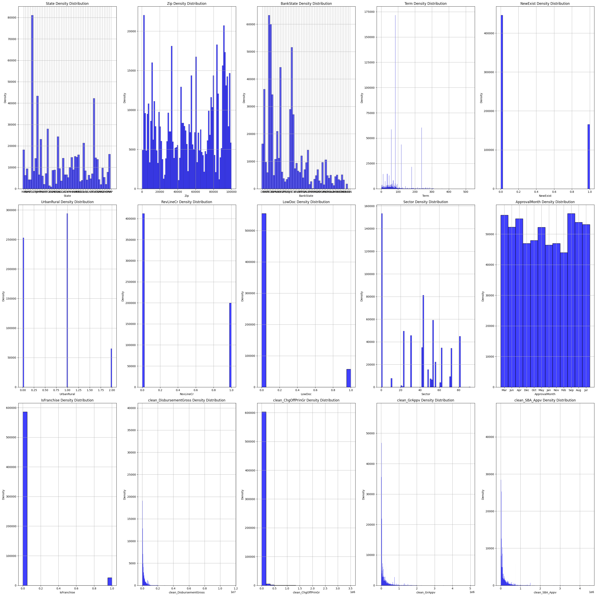
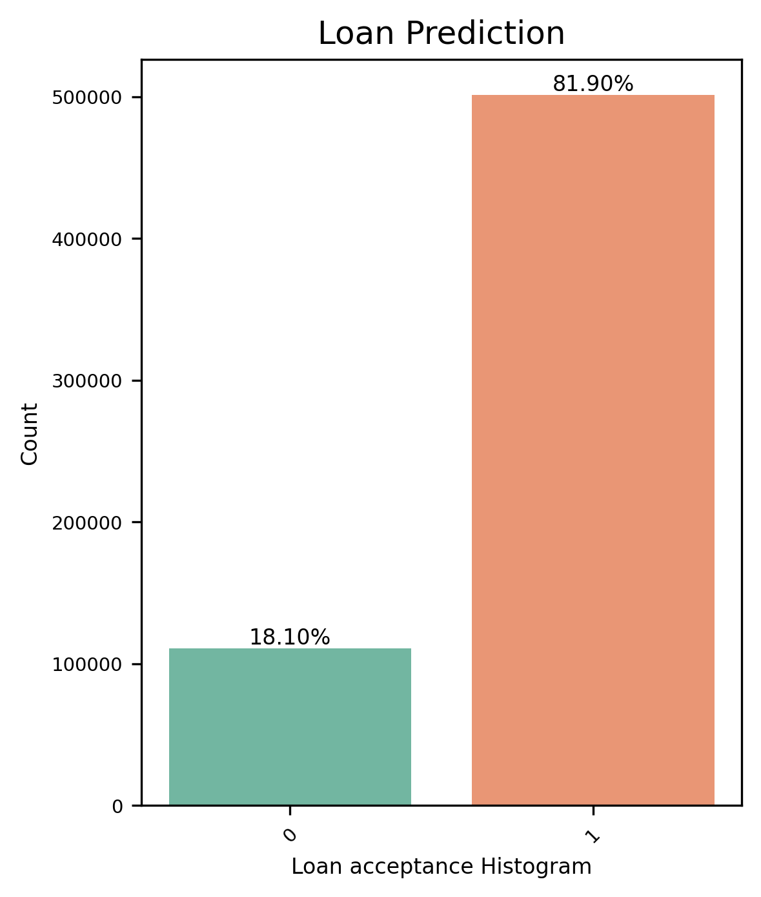
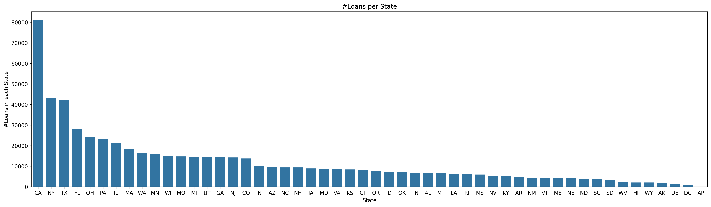

# Big Data and Cloud Computing

## i. Brief problem description

### Business Problem

Should a Loan be Approved or Denied?

### Problem Statement

Given the dataset from the U.S. Small Business Administration (SBA) comprising loan application information, the challenge is to develop a predictive model that effectively evaluates loan applications to determine whether they should be approved or denied.
By leveraging historical data on both successful and defaulted loans, the goal is to create a robust decision-making tool that balances the promotion of small business growth with the need to minimize credit risk.
This model should aid lending institutions in making informed decisions, ultimately contributing to the sustainability of small businesses and the broader economy.

### Dataset

| N. of features | N. of rows | Dataset size | Link |
|----------------|------------|--------------|------|
| 27             | 899164     | 179.43MB     | <https://www.kaggle.com/datasets/mirbektoktogaraev/should-this-loan-be-approved-or-denied/data> |

## ii. Project pipeline

## iii. Analysis and solution of the problem

### Preprocessing and Cleaning 1

#### Input Schema

root  
|-- LoanNr_ChkDgt: long (nullable = true)  
|-- Name: string (nullable = true)  
|-- City: string (nullable = true)  
|-- State: string (nullable = true)  
|-- Zip: integer (nullable = true)  
|-- Bank: string (nullable = true)  
|-- BankState: string (nullable = true)  
|-- NAICS: integer (nullable = true)  
|-- ApprovalDate: string (nullable = true)  
|-- ApprovalFY: string (nullable = true)  
|-- Term: integer (nullable = true)  
|-- NoEmp: integer (nullable = true)  
|-- NewExist: integer (nullable = true)  
|-- CreateJob: integer (nullable = true)  
|-- RetainedJob: integer (nullable = true)  
|-- FranchiseCode: integer (nullable = true)  
|-- UrbanRural: integer (nullable = true)  
|-- RevLineCr: string (nullable = true)  
|-- LowDoc: string (nullable = true)  
|-- ChgOffDate: string (nullable = true)  
|-- DisbursementDate: string (nullable = true)  
|-- DisbursementGross: string (nullable = true)  
|-- BalanceGross: string (nullable = true)  
|-- MIS_Status: string (nullable = true)  
|-- ChgOffPrinGr: string (nullable = true)  
|-- GrAppv: string (nullable = true)  
|-- SBA_Appv: string (nullable = true)  

#### Steps

A. Started by making a general report displaying the Type,
UniqueSample, N. of Unique, and %None for each column.

B. Show unique values and their percentage for each column.
C. Preprocess each column independently:

1. LoanNr_ChkDgt drop
    i. Dropped since it is an ID column.
2. Name - Name of Borrower
    i. Had 3 null rows, which were filled by ‘Unknown Name’.
    ii. This column has 86.70% unique values, which is not suitable for machine learning (lack of generalization).
3. City - City of Borrower
    i. Had 30 null rows, which were filled by ‘Unknown City’.
4. State - State of Borrower
    i. Had 14 null rows, some of these rows had a valid Zip code, so we can deduce these null values by checking the corresponding Zip code if it is repeated with a valid state.
    ii. After deducing, there is 1 null row remaining, which had a valid Zip code but that code was not repeated again in the dataset, so we googled this state and filled it manually.
5. Zip - Zip code of Borrower
    i. Least zip code in the US starts with 502, so any value less than this is invalid, so drop these rows.
6. Bank - Name of the bank that gave the loan
    i. Had 1558 null rows, which we filled by ‘Unknown Bank’
7. BankState - State of Bank
    i. Had 1565 null rows, drop these rows as we can’t populate them.
8. NAICS - North American Industry Classification System code for the industry where the business is located
    i. This row contains codes like [445291, 561910], we were given a transformation dictionary on kaggle that transforms each code to its corresponding sector by using the first 2 digits of the code.
    Ex: naics_to_sector = {
    22: 'Utilities',
    23: 'Construction', …, etc.
    }
    ii. Rename the transformed column to ‘Sector’.
9. ApprovalDate - Date SBA commitment issued
    i. The full date has too much detail, so we will extract the month only for analysis.
    ii. Rename the new column ‘ApprovalMonth’.
10. ApprovalFY - Fiscal Year of commitment drop
    i. Drop as it is a date in the past, so we can’t use them to identify loans at risk of default in the future.
11. Term - Loan term in months
    i. Clean, have no nulls.
12. NoEmp - Number of Business Employees
    i. Clean, have no nulls.
13. NewExist - 1 = Existing business, 2 = New business
    i.  Drop rows with 0 or Null.
    ii. Convert it to boolean, '2' is true, '1' is false.
14. CreateJob - Number of jobs created
    i. Clean, have no nulls.
15. RetainedJob - Number of jobs retained
    i. Clean, have no nulls.
16. FranchiseCode - Franchise code, (0 or 1) = No franchise
    i.  We don't care about the franchise code, we only care if there is a franchise or not, make 0 or 1 = 0, anything else = 1.
    ii. Rename the column to ‘IsFranchise’
17. UrbanRural - 1 = Urban, 2 = rural, 0 = undefined
    i. Clean, have no nulls.
18. RevLineCr - Revolving line of credit: Y = Yes, N = No
    i. Filter only Y and N.
    ii. Convert to boolean, Y=1, N=0.
19. LowDoc - LowDoc Loan Program: Y = Yes, N = No
    i. Filter only Y and N.
    ii. Convert to boolean, Y=1, N=0.
20. ChgOffDate - The date when a loan is declared to be in default drop
    i. Drop the column due to the high number of missing values.
21. DisbursementDate - Date when loan was disbursed drop
    i. Drop as the data in this column is filled in after a loan has defaulted, making them unnecessary for our model's predictive task of identifying loans at risk of default.
22. DisbursementGross - Amount disbursed
    i. Remove ‘$’, ‘,’, convert to float, ex:  $50,000.00 -> 50000.0.
    ii. Rename to ‘clean_DisbursementGross’.
23. BalanceGross - Gross amount outstanding drop
    i.  Drop as most of the values are 0
24. MIS_Status - Target variable
    i. Drop null rows.
    ii. Filter only "P I F" and "CHGOFF".
    iii. Make the column boolean "P I F" = 1, "CHGOFF" = 0.
25. ChgOffPrinGr - Charged-off amount
    i. Remove ‘$’, ‘,’, convert to float, ex:  $50,000.00 -> 50000.0.
    ii. Rename to ‘clean_ChgOffPrinGr’.
26. GrAppv - Gross amount of loan approved by bank
    i. Remove ‘$’, ‘,’, convert to float, ex:  $50,000.00 -> 50000.0.
    ii. Rename to ‘clean_GrAppv’.
27. SBA_Appv - SBA's guaranteed amount of approved loan
    i. Remove ‘$’, ‘,’, convert to float, ex:  $50,000.00 -> 50000.0.
    ii. Rename to ‘clean_SBA_Appv’.

#### Output Schema

root
 |-- Name: string (nullable = false)
 |-- City: string (nullable = false)
 |-- State: string (nullable = false)
 |-- Zip: string (nullable = true)
 |-- Bank: string (nullable = false)
 |-- BankState: string (nullable = true)
 |-- Term: integer (nullable = true)
 |-- NoEmp: integer (nullable = true)
 |-- NewExist: integer (nullable = false)
 |-- CreateJob: integer (nullable = true)
 |-- RetainedJob: integer (nullable = true)
 |-- UrbanRural: integer (nullable = true)
 |-- RevLineCr: integer (nullable = false)
 |-- LowDoc: integer (nullable = false)
 |-- Sector: string (nullable = true)
 |-- ApprovalMonth: string (nullable = true)
 |-- IsFranchise: integer (nullable = false)
 |-- clean_DisbursementGross: float (nullable = true)
 |-- MIS_Status: integer (nullable = false)
 |-- clean_ChgOffPrinGr: float (nullable = true)
 |-- clean_GrAppv: float (nullable = true)
 |-- clean_SBA_Appv: float (nullable = true)

Final DF count: 611846

### EDA

#### Features Density Distribution

#### Prior Class Distribution

As observed, there is a class imbalance in the dataset, where most of the
loans are paid in full (MIS_Status = 1).

#### Features vs Target Value

#### Correlation Matrix

Very high correlation between:
a. Createjob - Retainedjob (100%)
b. clean_DisbursementGross - clean_GrAppv (96%)
c. clean_DisbursementGross - clean_SBA_Appv (93%)
d. clean_GrAppv - clean_SBA_Appv (98%)
Their density distributions are also very similar

#### Box Plot Examples

#### General Insights

1. 
The vast majority of loans originate from California, due to factors like: high population density, high economic activity, active real estate market.

2. 
It appears that banks often extend loans to small businesses located in different states. For instance, while most loans are provided by banks headquartered in North Carolina, North Carolina doesn't rank among the top 15 states in terms of loan origination. In simpler terms, banks from various states are lending to businesses outside their own state boundaries.

3. 
The highest number of loans approved in September, due to factors like the end of summer vacations, back-to-school expenses, or fiscal year-end considerations for businesses and organizations.

4. 
Most loans are lended to the “Retail Trade” sector (NAICS code
44).

### Association Rules

#### Prepare dataframe

1. Append column name at the beginning of each item in the column
to help differentiate values after creating the itemsets.
2. Concatenate columns to create itemsets
Example:
[JC, NORTHAMPTON, MA, 1060, FLORENCE, MA, 60, 2, 0, 0, 2, 1, 1, 0, 23, Apr, 0, 135070.0, 1, 0.0,
35000.0, 17500.0]
becomes
[Name_JC, City_NORTHAMPTON, State_MA, Zip_1060, Bank_FLORENCE, BankState_MA, Term_60,
NoEmp_2, NewExist_0, CreateJob_0, RetainedJob_2, UrbanRural_1, RevLineCr_1, LowDoc_0, Sector_23,
ApprovalMonth_Apr, IsFranchise_0, clean_DisbursementGross_135070.0, MIS_Status_1,
clean_ChgOffPrinGr_0.0, clean_GrAppv_35000.0, clean_SBA_Appv_17500.0]

#### Sorting Association Rules

#### Interesting Rules

- LowDoc_0 -> IsFranchise_0
  - Those who request loans that are not low doc are not franchises.
  - This rule has the highest support (0.86) and a very high confidence (0.96) and lift (1.001)

- MIS_Status_1 -> clean_ChgOffPrinGr_0.0
  - If a loan is paid in full, then there is no money to be charged off.
  - This rule has the 3rd highest support (0.81) and a very high confidence (0.99) and lift (1.22)
- MIS_Status_1 ->  IsFranchise_0
  - If a loan is paid in full, then the loan was requested by a non franchise
  - This rule has the 5th highest support (0.78) and a very high confidence (0.95) and lift (0.99)

#### Exploring Relationships Between Support, Confidence, and Lift

## Preprocessing and Cleaning 2

### Drop

1. ‘ApprovalMonth’ The data in this column is filled in after a loan has defaulted, making it unnecessary for our model's predictive task of identifying loans at risk of default.
2. ‘ChgOffPrinGr’ this column leaks information to the model, since logically if there is an amount to be charged off then the loan itself is charged off, this is also observable in the association rule MIS_Status_1 -> clean_ChgOffPrinGr_0.0, also this column is filled in after a loan has defaulted.
3. ‘Retainedjob’, and ‘clean_SBA_Appv’ due to high correlation.
4. ‘Name’, ‘City’, and ‘Zip’ as they contain too many unique values and will affect the model’s generalization.

### Final Schema

root
 |-- State: string (nullable = true)
 |-- Bank: string (nullable = true)
 |-- BankState: string (nullable = true)
 |-- Term: integer (nullable = true)
 |-- NoEmp: integer (nullable = true)
 |-- NewExist: integer (nullable = true)
 |-- CreateJob: integer (nullable = true)
 |-- UrbanRural: integer (nullable = true)
 |-- RevLineCr: integer (nullable = true)
 |-- LowDoc: integer (nullable = true)
 |-- Sector: integer (nullable = true)
 |-- IsFranchise: integer (nullable = true)
 |-- clean_DisbursementGross: double (nullable = true)
 |-- MIS_Status: integer (nullable = true)
 |-- clean_GrAppv: double (nullable = true)

## Machine Learning

### Data Preparation

#### Split

Percentages for the training, validation, and test sets are 60-20-20.

#### Categorical Features

Transform categorical features to one hot encoding.

#### Model Evaluation

After evaluating the models on the validation set, we chose the best-performing model based on the F1 score, which we will select for final training.

#### Model Training

Once the best model is selected, it is trained on the entire training dataset (combining training and validation sets). This step ensures the model learns from as much data as possible before final evaluation.

#### Model Testing

The final step involves evaluating the selected model's performance on the test set, which is data the model has never seen before. This step provides a more accurate estimation of how the model will perform on unseen data in real-world scenarios.

### KNN Implementation

We also implemented the KNN classifier using MapReduce.
Similarity between neighbors is calculated using cosine similarity, which handles sparse vectors (due to one hot encoding of categorical features) better than euclidean distance.

#### Map

- The map phase will determine the k-nearest neighbors in the different splits of the data.
- As a result of each map, the k nearest neighbors together with their computed distance values will be emitted to the reduce phase.
- Key-value pair: `<None,{'similarity': dist, 'class': true_class}>`

#### Reduce

- The reduce phase will compute the definitive neighbors from the list obtained in the map phase.
- The reduce phase will determine which are the final k nearest neighbors from the list provided by the maps

#### KNN Classifier Notes

1. There is no training error since there is no training at all for the KNN classifier, it just stores the training data.
2. Results and evaluation were tested using only 50,000 rows for the full dataset, and 500 rows from the validation set after splitting. Evaluating each point requires calculating the distance between the validation point and each training point, which consumes a lot of time even when running in fully distributed mode on Azure. Additionally, due to our limited credit on Azure, we could not scale up the cluster further.

## iv. Results and Evaluation

| Metric    | Logistic Regression (maxIter=10) |  | Random Forest |  | GBT (maxIter=100) |  | SVM (maxIter=100) |  | KNN (k=3) |  |
|-----------|:--------------------------------:|:-:|:-------------:|:-:|:-----------------:|:-:|:----------------:|:-:|:---------:|:-:|
|           | Train | Validation | Train | Validation | Train | Validation | Train | Validation | Train | Validation |
| Accuracy  | 0.8831 | 0.8795 | 0.8191 | 0.8193 | 0.9336 | 0.9333 | 0.8885 | 0.8845 | - | 0.722 |
| Precision | 0.8751 | 0.8706 | 0.6710 | 0.6713 | 0.9317 | 0.9313 | 0.8815 | 0.8768 | - | 0.697 |
| Recall    | 0.8831 | 0.8795 | 0.8191 | 0.8193 | 0.9336 | 0.9333 | 0.8885 | 0.8845 | - | 0.592 |
| F1 Score  | 0.8734 | 0.8693 | 0.7377 | 0.7380 | 0.9318 | 0.9314 | 0.8818 | 0.8775 | - | 0.64  |

As observed, the best performing model is GBT, so we will train on training+validation set and test it on test data:

| Metric    | GBT (Train) | GBT (Test) |
|-----------|:-----------:|:----------:|
| Accuracy  | 0.9357      | 0.9345     |
| Precision | 0.9339      | 0.9326     |
| Recall    | 0.9357      | 0.9345     |
| F1 Score  | 0.9340      | 0.9328     |

## v. Unsuccessful trials that were not included in the final solution

1. Tried to perform all Exploratory Data Analysis (EDA) using PySpark DataFrame (DF) and Plotly (2_EDA.ipynb), but the results were not as good as matplotlib, which doesn’t work by default with PySpark DF. So, we used pandas for EDA instead (3_EDA.ipynb).
2. Tried including some previously dropped columns in the training to assess their impact on accuracy and ensure the correctness of our analysis. However, it turns out they don't provide any benefits, and sometimes they significantly worsen accuracy.

## vi. Any Enhancements and future work

Make hyperparameter tuning for each model instead of using the default parameters.
Instead of dropping columns that contain a lot of unique values, try to group some of these values using clustering techniques, or find the most important values and mark the others as ‘Other’.

## vii. Working in fully distributed mode

Deployed a Spark cluster on Azure using HDInsight, with the following specifications:

- Head node x2
  - E8 V3 (8 Cores, 64 GB RAM)
- Zookeeper node x3
  - A2 v2 (2 Cores, 4 GB RAM)
- Worker node x3
  - A4m v2 (4 Cores, 32 GB RAM)

And, ran each Jupyter notebook of the project on it in fully distributed mode.

### Screenshots

#### Hosts

#### Worker 0 Metrics

